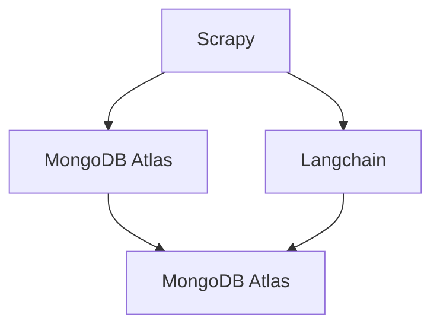

# Project Gutenberg Embedding

A web scraper that is made to parse all Ebooks on [Project Gutenberg](https://www.gutenberg.org/). Also embedding all of the book's text into a vector storage on [MongoDB Atlas](https://www.mongodb.com/products/platform/atlas-vector-searchom/atlas/database) with [Langchain](https://python.langchain.com/).

## How it works

