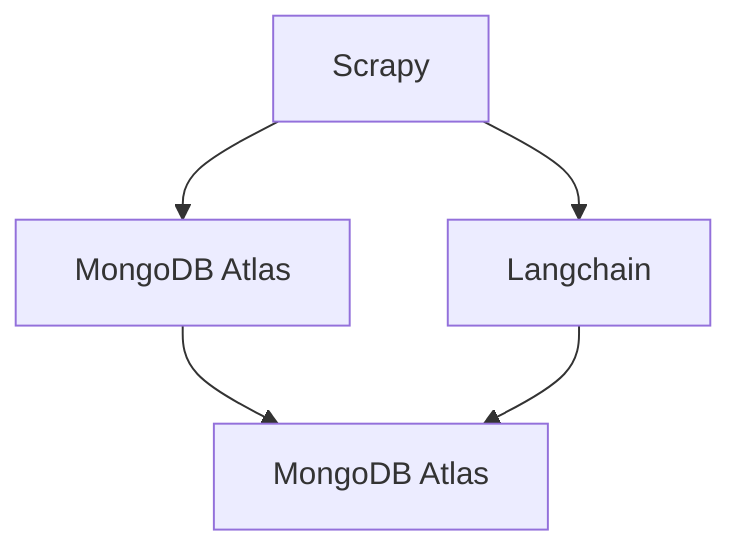

# Project Gutenberg Embedding

A web scraper that is made to parse all Ebooks on [Project Gutenberg](https://www.gutenberg.org/). Also embedding all of the book's text into a vector storage on [MongoDB Atlas](https://www.mongodb.com/products/platform/atlas-vector-searchom/atlas/database) with [Langchain](https://python.langchain.com/).

## How it works

First the scraper goes to the [Category Page](https://www.gutenberg.org/ebooks/bookshelf/57) and gets all the Ebooks and their metadata (like IDs). Each category page returns 25 Ebooks at a time. To get all the Ebooks, we need to use pagination, to pages like the `start_index` of 26 (https://www.gutenberg.org/ebooks/bookshelf/57?start_index=26).

The Scrapy Pipeline then gets passed all items, and using Langchain embeds them into MongoDB. For this we use OpenAI.